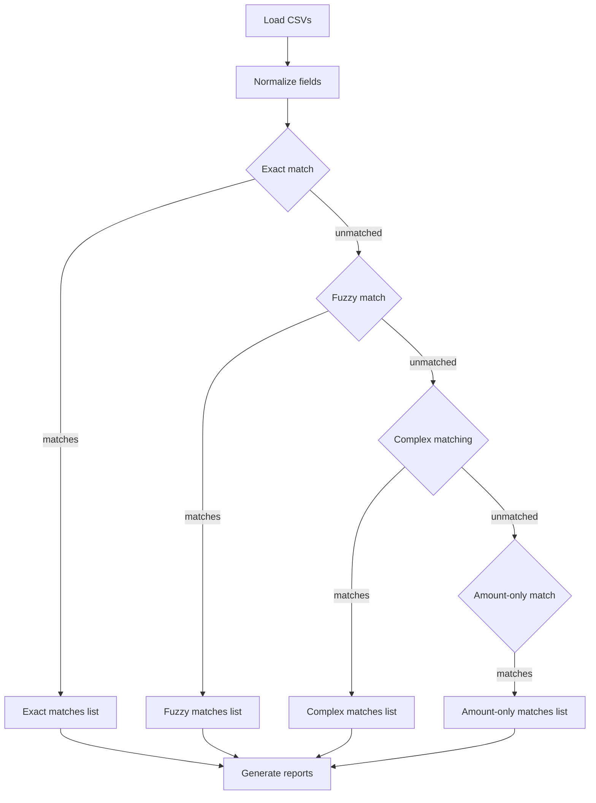
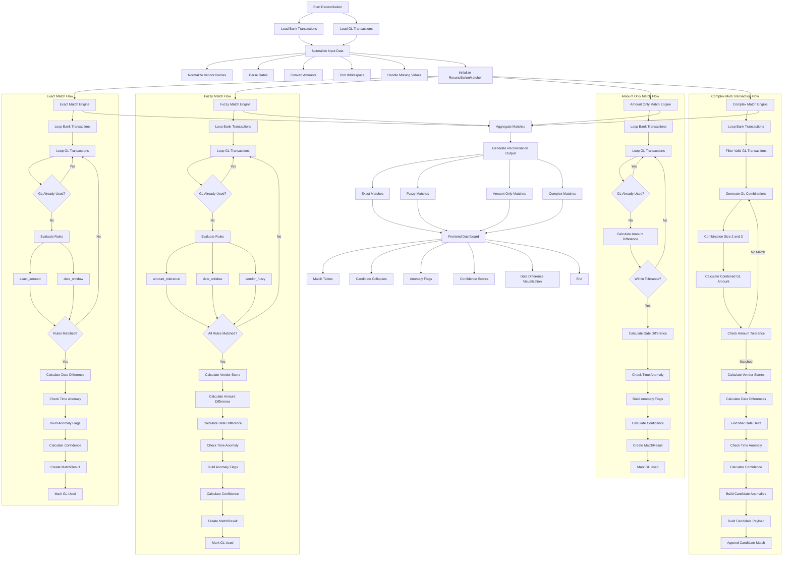

# Reconciliation Engine

This package implements a transaction reconciliation engine that compares bank transactions to general ledger (GL) entries and produces matched pairs, multi-transaction matches, and anomaly information.

## Overview

- Input: CSV files (bank and GL) parsed into `Transaction` models.
- Normalization: amounts, dates, vendor text and references are normalized by `validators.py` before matching.
- Match types: `exact`, `fuzzy`, `complex` (multi-transaction grouping), and `amount-only`.
- Outputs: CSV reports and a `reports/summary.json` plus `reports/README.md` created by `reporting.py`.

The high-level pipeline:

Detailed pipeline:

## Transaction model

Transactions are represented by `models.Transaction` with fields:

- `id` (string)
- `amount` (Decimal)
- `date` (datetime or None)
- `description` (string)
- `reference` (optional string)
- `source` (string)

Normalization functions live in `validators.py`:

- `normalize_amount(value)` — strips punctuation, commas and returns `Decimal(...).quantize(0.01)`.
- `normalize_date(value)` — parses a variety of date formats into `datetime` or `None`.
- `normalize_vendor(description)` / `clean_text(...)` — lowercases, removes punctuation and common legal suffixes (`inc`, `llc`, `ltd`, etc.), and drops noise tokens like `payment to` or `gl entry`.

## Matching rules and scoring

Rules are implemented in `rules.py`. Each rule has a `name` and `weight`. The rule set and default weights are:

- `ExactAmountRule` (`exact_amount`) — weight 40. Passes when amounts are equal.
- `ReferenceRule` (`reference`) — weight 30. Passes when both sides have a `reference` and `use_reference_match` is enabled.
- `DateWindowRule` (`date_window`) — weight 10. Passes when dates exist and delta <= `date_tolerance_days` (default 10).
- `AmountToleranceRule` (`amount_tolerance`) — weight 10. Passes when |bank - gl| <= `amount_tolerance` (default 100).
- `VendorFuzzyRule` (`vendor_fuzzy`) — weight 10. Passes when fuzzy vendor score >= `vendor_threshold` (default 80).

Total rule weight sum: 100 (40+30+10+10+10).

### Exact matches

- Engine: `ReconciliationMatcher.exact_match(...)`
- Requirements: rules `exact_amount` AND `date_window` must pass for the pair to be considered an exact match.
- Confidence: calculated by `calculate_confidence(matched_rules)` as:

$$\text{confidence} = \left(\frac{\sum\text{matched rule weights}}{\sum\text{all rule weights}}\right) \times 100$$

Example: if `exact_amount` (40) and `date_window` (10) match, confidence = (50 / 100) * 100 = 50.00

### Fuzzy matches

- Engine: `ReconciliationMatcher.fuzzy_match(...)`
- Required rules: `amount_tolerance`, `date_window`, and `vendor_fuzzy` must all pass.
- Components used to compute confidence:
	- `vendor_score` = `rapidfuzz.fuzz.token_sort_ratio(normalize_vendor(bank.description), normalize_vendor(gl.description))` (0–100)
	- `amount_score` = max(0, 100 - (amount_diff / amount_tolerance) * 100)
	- `date_score` = max(0, 100 - (date_diff / date_tolerance) * 100)

Final fuzzy confidence (code):

$$\text{confidence} = \text{round}(0.4\times\text{amount\_score} + 0.2\times\text{date\_score} + 0.4\times\text{vendor\_score},2)$$

This yields a blended percentage between amount closeness, date proximity and vendor text similarity.

### Amount-only matches

- Engine: `ReconciliationMatcher.amount_only_match(...)`
- Condition: |bank - gl| <= `amount_tolerance`.
- Confidence:

$$\text{confidence} = \text{round}\left(\max\left(0, 100 - \frac{\text{amount\_diff}}{\text{tolerance}}\times 100\right), 2\right)$$

This is a linear decay from 100 down to 0 as the difference approaches the tolerance.

### Complex / Multi-transaction matches

- Engine: `ReconciliationMatcher.complex_match(...)`
- Strategy:
	- For each bank transaction, find GL transactions with vendor fuzzy score >= `vendor_threshold` and within a small candidate date window.
	- For candidate GLs, sort by absolute amount difference and keep top `max_candidates_per_bank`.
	- Consider combinations of sizes 2 and 3. For each combo, compute `combo_total` and accept combos where |bank_amount - combo_total| <= tolerance.
	- Compute `avg_vendor_score` across combo members and `max_date_delta` across their dates.

- Confidence (code):

$$\text{confidence} = \text{round}\left(0.5\times(100 - \text{amount\_diff}) + 0.5\times\text{avg\_vendor\_score}, 2\right)$$

Note: amount_diff here is the raw absolute difference between bank and combined GL amounts (not normalized by tolerance). The matcher also returns candidate-level anomaly metadata for transparency.

## Anomaly detection and flags

Anomaly flags are generated by `build_anomaly_flags(...)` and include:

- `round_amount_match`: integers or 1-digit rounding matches (int equality or rounding to 1 decimal place).
- `unusual_amount`: True when amount_difference > tolerance.
- `unusual_dates`: True when date difference > `time_anomaly_days` (default 10 days defined in `config.py`).
- `missing_data`: True when required fields (date, amount, description) are missing on either side.
- `confidence` in anomaly flags: a percent computed as:

$$\text{anomaly confidence} = \text{round}\left(\max\left(0, 1 - \frac{|bank\_amount - gl\_amount|}{\max(bank\_amount,1)}\right) \times 100, 2\right)$$

This provides a quick, relative measure of how close two amounts are as a percentage of the bank amount.

## Configuration and API / CLI

- Defaults are set in `config.py` (e.g. `TIME_ANOMALY_DAYS = 10`).
- Available runtime options (used by `api.reconcile` and `cli.run_cli`):
	- `use_reference_match` (bool) — enable/disable `reference` rule.
	- `amount_tolerance` (float) — default 100.
	- `date_tolerance_days` (int) — default 10.
	- `vendor_threshold` (int) — fuzzy vendor score threshold, default 80.
	- `enable_exact`, `enable_fuzzy`, `enable_complex`, `enable_amount_only` — which match engines to run.

API endpoint: `POST /reconcile` accepts multipart form with `bank_file` and `gl_file` CSV uploads and the form fields above. See [api.py](api.py#L1) for parameter names and defaults.

CLI: run the package in non-FASTAPI mode and the `run_cli()` flow reads fixtures from `tests/fixtures` defined in [config.py](config.py#L1-L20) and writes reports to `reports/`.

## Reports and output files

Outputs are saved to the `reports/` directory by `reporting.generate_response`:

- `exact_matches.csv` — one row per exact/fuzzy/amount-only match with explanation fields.
- `fuzzy_matches.csv`
- `complex_matches.csv` — complex matches are expanded with candidate rows for each combination.
- `amount_only_matches.csv`
- `summary.json` — high level counts and `vendor_groups` mapping.
- `README.md` — a generated human-readable vendor grouping summary.

CSV columns are created in `reporting.save_csv()` — they include IDs, descriptions, normalized vendor strings, amounts, candidate GL ids, confidence, matched rules and match types. See `reporting.py` for the exact column mapping.

## Where to look in the code

- Matching engine: [matcher.py](matcher.py#L1-L1)
- Rule definitions/weights: [rules.py](rules.py#L1-L1)
- Normalizers: [validators.py](validators.py#L1-L1)
- API endpoint and parameter list: [api.py](api.py#L1-L1)
- Reporting output: [reporting.py](reporting.py#L1-L1)
